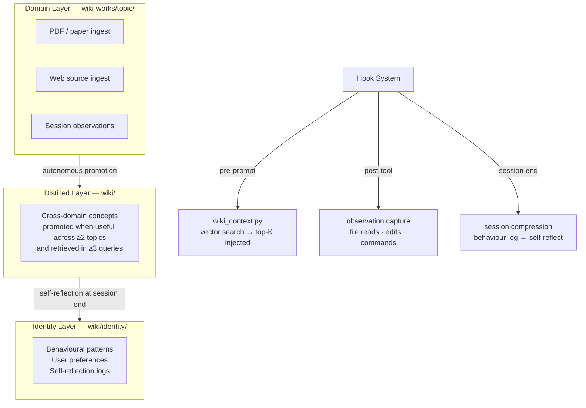

<div align="center">

# 🧬 ai-longterm-wiki-memory-OpenClaw

### Semantic long-term memory for any AI agent, any LLM, any platform

[](https://python.org)
[](tests/)
[](https://lancedb.com)
[](https://github.com/openclaw/openclaw)
[](LICENSE)
[](https://github.com/giovannifrontera/ai-longterm-wiki-memory-OpenClaw/commits)

[Problem](#-the-problem) · [Theory](#-theoretical-framework) · [Architecture](#-three-layer-architecture) · [Features](#-features) · [Interface](#-web-interface) · [Quick Start](#-quick-start) · [Ecosystem](#-ai-wiki-ecosystem)

</div>

> **🤖 If you are an AI agent reading this:** read [`AGENTS.md`](AGENTS.md) before proceeding. It contains mandatory installation steps — skipping them means context injection will silently fail.

---

## 🎯 The Problem

AI agents forget everything between sessions. Existing memory systems are **flat** — a pile of timestamped facts with no structure, no interconnection, and no ability to distinguish deep domain knowledge from cross-domain principles. When you work on recurring research — academic literature, competitive analysis, long-running software projects — you need knowledge that is *organised, interconnected, semantically searchable*, and that grows over time without human bookkeeping.

This project gives any AI agent — regardless of the underlying LLM or platform — a **three-layer external brain** it maintains autonomously. Every interaction deepens the knowledge base; no session starts from zero.

---

## 📚 Theoretical Framework

### Extended Mind Thesis (Clark & Chalmers, 1998)
If a notebook functions as reliably as biological memory in directing behaviour, it counts as part of the cognitive system (Clark & Chalmers, 1998). This project operationalises that thesis: the wiki-memory system extends the agent's effective cognitive reach beyond any single context window, functioning as a genuine component of its reasoning apparatus — not a retrieval bolt-on.

### Tulving's Episodic and Semantic Memory
Tulving (1972) distinguishes *episodic memory* (time-stamped events) from *semantic memory* (general, context-independent knowledge). The three-layer architecture mirrors this: the Domain layer stores deep semantic knowledge per topic; the Identity layer stores episodic behavioural patterns; the Distilled layer manages the episodic-to-semantic transition through autonomous promotion.

### Distributed Cognition (Hutchins, 1995)
Cognition is not confined to individual minds — it is distributed across agents, tools, and artefacts in a system (Hutchins, 1995). The wiki-memory system externalises cognitive work into a distributed structure: agent, Markdown wiki, vector index, and hook system form a single cognitive unit that is more capable than any component alone.

### Ebbinghaus Forgetting Curve
Without reinforcement, information decays exponentially (Ebbinghaus, 1885). The autonomous promotion mechanism operationalises spaced repetition at the system level: knowledge retrieved frequently across multiple domains is promoted to more accessible layers; stale knowledge is flagged for review.

---

## 🏗 Three-Layer Architecture



**Core invariant:** the agent never writes directly to the wiki. Everything goes through `wiki.py`. The skill guides *when* and *why*; the scripts handle *how*.

### Dual-Representation Pattern
Every wiki page exists simultaneously in two synchronised forms:

```
  Write a wiki page
        │
        ▼
┌───────────────────┐     ┌──────────────────────────┐
│  Markdown file    │     │  LanceDB vector store     │
│  wiki/concepts/   │◄────►  bge-m3 embeddings        │
│  rag.md           │     │  1024-dim, HNSW index     │
└───────────────────┘     └──────────────────────────┘
   humans browse               agent retrieves
   agent generates             semantically
```

Markdown and embeddings are written **atomically** (`tmp → staging → production`) and kept in sync at all times. A crash at any point leaves the system in a detectable, recoverable state.

---

## ✨ Features

### LLM-Agnostic
Works with **any LLM or agent framework** that can read files and call bash commands. The memory backend (Python + LanceDB) is completely decoupled from the inference layer. Tested integrations: OpenClaw (Telegram, Discord, web), Claude Code, Gemini CLI, Codex, OpenCode. Switch models freely — the wiki persists unchanged.

### Semantic Vector Search
[bge-m3](https://huggingface.co/BAAI/bge-m3) embeddings — multilingual (100+ languages), 1024-dim, HNSW index. Queries retrieve by *meaning*, not keywords. A query about *"how LLMs handle long context"* retrieves pages about *"positional encoding"* and *"sliding window attention"* with no keyword overlap — because the meaning is close in embedding space.

### Pre-Prompt Context Injection
`wiki_context.py` runs a vector search **before every user message** and prepends a `<wiki-context>` block with the top-K most relevant pages. The agent has relevant context regardless of how it classifies the message — no manual invocation required.

### Multi-Source PDF Ingestion
Any PDF from any source converges at `pdf-inbox/`:

```
Telegram attachment → pdf-inbox/ → SHA-256 dedup → pdfplumber extraction
URL (50 MB cap)    →             → atomic registry → wiki-works/*/raw/
CLI / folder drop  →             → crash recovery  → structured pages
```

### Auto-Synthesis
When a query response integrates ≥ 2 wiki sources, exceeds 300 tokens, and adds non-literal inference, the agent saves it as a new wiki page with embeddings. Knowledge compounds over time without human curation.

### Autonomous Promotion
Pages retrieved in ≥ 3 distinct queries across ≥ 2 topics are automatically promoted from the Domain layer to the Distilled layer — cross-domain knowledge becomes more accessible over time.

### Behavioural Self-Reflection
User corrections ("always", "never", "stop doing X") are logged via `wiki.py behavior-log`. At session end, `wiki.py self-reflect` updates `wiki/identity/` autonomously when a pattern reaches the threshold (default: 3 occurrences). The agent learns without requiring human approval of each update.

### Self-Healing Lint

| Issue | Detection | Repair |
|---|---|---|
| Broken wiki links | Regex scan `[[target]]` → no matching file | Log orphan links |
| Orphan vectors | LanceDB IDs absent from filesystem | Auto-delete stale records |
| File renames | `content_hash` match between DB-only and filesystem-only paths | Update path without re-embedding |
| Semantic duplicates | Cosine similarity > 0.95 | Flag for merge; > 0.90 auto-merge candidate |

### Token-Budget Index
`index.md` respects a configurable token budget (default 4,000). When exceeded, applies reduction strategies automatically — so the agent can navigate even on small context windows.

---

## 🖥 Web Interface

```bash
python scripts/wiki.py serve --workspace /path/to/workspace [--port 7331]
```

Open `http://localhost:7331`.

### Graph View
A D3.js force-directed graph shows all wiki pages as nodes:
- **Node colour** — category (entities: blue · concepts: green · synthesis: violet · identity: gold)
- **Node size** — proportional to degree (connections)
- **Explicit edges** — `[[wiki-link]]` references → solid arrows
- **Semantic edges** — cosine similarity ≥ 0.65 → dashed lines
- **Live updates** — WebSocket pushes `graph_update` on any file change; node positions preserved
- **Query-hit animation** — retrieved nodes pulse gold→red for 4 seconds in real time
- **Page panel** — click any node → rendered markdown + outgoing/incoming links + similar pages with similarity bars

### Stats Dashboard

```
┌──────────┐  ┌──────────┐  ┌──────────┐  ┌─────────┐
│ 47 pages │  │ 312 chunk│  │ 94% cov. │  │ 3 stale │
└──────────┘  └──────────┘  └──────────┘  └─────────┘

Top queried            Lint status
─────────────          ───────────────────────────────
rag.md      12q        Last run: 2026-05-23
openai.md    8q        0 errors · 2 warnings · [Run now]

Auto-lint: every 24h · next: 2026-05-24 08:15
```

**REST endpoints:**

| Method | Endpoint | Description |
|---|---|---|
| `GET` | `/api/graph` | All nodes + edges as JSON |
| `GET` | `/api/page/{path}` | Page content + metadata + links |
| `GET` | `/api/stats` | KPIs, lint status, query log |
| `POST` | `/api/lint` | Trigger lint run (409 if busy) |
| `WS` | `/ws` | Live graph + query-hit events |

**Auth:** JWT cookie (7-day session), password set via `wiki.config.json` or `WIKI_PASSWORD` env. Bypass with `--no-auth` for local use.

---

## 🔬 Technical Deep-Dive

### Filesystem Layout

```
workspace/
├── skills/wiki-core.md          ← agent skill: intent classification + workflows
├── wiki-session.md              ← live session state (ok | in-progress | needs-repair)
├── wiki.config.json             ← configuration
├── scripts/
│   ├── wiki.py                  ← unified CLI (11 commands)
│   ├── wiki_context.py          ← pre-prompt hook
│   ├── wiki_pdf_watcher.py      ← PDF inbox scanner (SHA-256 + pdfplumber)
│   ├── wiki_embed.py            ← boundary-aware chunking + bge-m3
│   ├── wiki_lancedb.py          ← LanceDB ops (upsert, staging, rename detection)
│   ├── wiki_index.py            ← token-budget index generation
│   ├── wiki_graph.py            ← node/edge builder (30s cache)
│   └── wiki_server.py           ← FastAPI: REST, WebSocket, JWT, stats/lint
├── frontend/index.html          ← SPA: D3.js + page panel + WebSocket client
├── pdf-inbox/.registry.json     ← SHA-256 hash + status per PDF (atomic write)
├── wiki/                        ← Distilled + Identity layers
│   ├── concepts/ entities/ synthesis/
│   └── identity/                ← written only by wiki.py self-reflect
├── wiki-works/topic/            ← Domain layer (permanent, per topic)
│   └── raw/ concepts/ entities/ synthesis/
└── memory/lancedb/              ← unified vector space for all three layers
```

### LanceDB Schema

```
wiki_pages table:
  id            STRING PRIMARY KEY    -- relative path from workspace root
  title         STRING
  category      STRING                -- entities | concepts | synthesis | identity | raw
  content       STRING                -- markdown body (truncated, 512-token chunks)
  project       STRING                -- source domain/workspace
  last_modified FLOAT                 -- Unix timestamp (drives staleness detection)
  vector        FLOAT[1024]           -- bge-m3 embedding (HNSW index)

staging_wiki_pages table:          -- identical schema; vectors promoted atomically
```

### Chunking Strategy
Pages are split using the bge-m3 native tokenizer. Boundaries respect `##` and `###` headings — chunks never cut mid-section. Pages under 1,500 tokens are embedded whole; larger pages use 512-token chunks with 64-token overlap. Upsert deletes all existing chunks for a path before inserting new ones — no orphan chunks when a page changes.

### CLI Reference

```
wiki.py ingest         --workspace <path> --pages <p1.tmp,...> --log <str>
wiki.py query          --workspace <path> --q <string> [--k 5]
wiki.py lint           --workspace <path> [--full]
wiki.py index          --workspace <path>
wiki.py rebuild        --workspace <path>
wiki.py scan-inbox     --workspace <path>
wiki.py ingest-pdf     --workspace <path> --file <local-path|url>
wiki.py serve          --workspace <path> [--host] [--port 7331] [--no-auth]
wiki.py behavior-log   --workspace <path> --event "<correction>"
wiki.py self-reflect   --workspace <path>
wiki.py session-update --workspace <path> --op <type> --status <ok|failed|...>

wiki_context.py        --workspace <path> --q <string> [--k 3] [--max-chars 600]
```

All commands output structured JSON to stdout.

---

## 🏛 Architectural Decisions

**LLM-agnostic backend:** The Python/LanceDB stack has zero dependencies on any specific inference provider. The agent skill (`wiki-core.md`) guides intent classification and workflow routing using natural language — any LLM that can follow instructions can use it. This is a deliberate design choice: the memory system outlasts any particular model generation.

**Markdown-first over pure vector:** Markdown files are human-readable, Git-trackable, and editable without special tooling. The vector index is a derived artefact that can always be rebuilt from source via `wiki.py rebuild`. Researchers retain full auditability and manual curation capability.

**Staging table for atomic ingest:** Vectors are written to `staging_wiki_pages` first. Only `promote_staging()` moves them to `wiki_pages`. A crash leaves staging populated; the next session clears it and logs the event — no silent data corruption.

**Identity layer write-protected:** `wiki/identity/` is written *only* by `wiki.py self-reflect`, never directly by the agent. This prevents real-time feedback loops where current behaviour immediately reinforces itself, ensuring genuine long-term pattern stabilisation.

---

## ⚠️ Known Limitations

- **No transactional semantics:** LanceDB does not support rollback. Crashes between vector write and Markdown write create orphan vectors — resolved by the next lint run.
- **Single-machine:** The current architecture targets a single researcher's local machine. Shared team wikis require a centralised LanceDB instance or REST API layer.
- **Scanned PDFs:** Image-only PDFs (no selectable text) are flagged `status: failed` in the registry and skipped on future scans — no OCR support currently.
- **Hook latency:** The first SessionStart hook after a large ingest may be slow (cold LanceDB HNSW index construction).

---

## 🚀 Quick Start

### Requirements

- Python 3.10+
- ~2 GB disk (BAAI/bge-m3, downloaded automatically on first run)

### Install

```bash
git clone https://github.com/giovannifrontera/ai-longterm-wiki-memory-OpenClaw
cd ai-longterm-wiki-memory-OpenClaw
pip install -r requirements.txt
```

### Configure

```bash
cp wiki.config.json my-workspace/wiki.config.json
# Edit: set workspace path, projects, keywords
```

Minimal `wiki.config.json`:
```json
{
  "workspace": "/path/to/workspace",
  "projects": {
    "research": {
      "path": "wiki-works/research",
      "keywords": ["paper", "study", "review", "article"]
    }
  },
  "lancedb": { "path": "memory/lancedb", "embedding_model": "BAAI/bge-m3" },
  "thresholds": {
    "index_token_budget": 4000,
    "staleness_days": 90,
    "synthesis_min_tokens": 300,
    "synthesis_min_sources": 2
  }
}
```

### Initialise and Test

```bash
python scripts/wiki.py rebuild --workspace my-workspace/
pytest tests/ -v
# Expected: 124 passed
```

### OpenClaw Integration

```bash
# Agent-driven setup (recommended — ask the agent to install)
python scripts/setup_openclaw.py --workspace /absolute/path/to/workspace

# Manual
cd plugins/wiki-context-plugin && npm install && npm run build
```

Add to OpenClaw config:
```json
{
  "plugins": [{
    "id": "wiki-context-plugin",
    "path": "/absolute/path/to/plugins/wiki-context-plugin",
    "config": {
      "workspace": "/absolute/path/to/workspace",
      "wikiContextScript": "/absolute/path/to/scripts/wiki_context.py",
      "pythonExecutable": "python",
      "k": 3
    }
  }]
}
```

For other agent integrations (Claude Code, Gemini CLI, Codex), see [`docs/integrations/`](docs/).

---

## 🌐 AI-Wiki Ecosystem

This project is part of a coherent research toolchain for AI-augmented academic knowledge management:

| Project | LLM | Role |
|---|---|---|
| **ai-longterm-wiki-memory-OpenClaw** ← *you are here* | Any (LLM-agnostic) | Persistent memory for any agent via OpenClaw, Telegram, Discord, web |
| [ai-longterm-wiki-memory-ClaudeCode](https://github.com/giovannifrontera/ai-longterm-wiki-memory-ClaudeCode) | Claude | Native Claude Code integration — MCP + hooks |
| [ai-wiki-graph-RAG-lms](https://github.com/giovannifrontera/ai-wiki-graph-RAG-lms) | Anthropic / OpenAI | LTI 1.3 backend for Moodle, Canvas, Blackboard, Sakai, Open edX |
| [academic-PRISMA-research-workflow](https://github.com/giovannifrontera/academic-PRISMA-research-workflow) | Claude | Systematic review automation — feeds evidence-based content into the wiki |

---

## 📖 References

1. Clark, A., & Chalmers, D. (1998). The extended mind. *Analysis*, 58(1), 7–19. https://doi.org/10.1093/analys/58.1.7
2. Tulving, E. (1972). Episodic and semantic memory. In E. Tulving & W. Donaldson (Eds.), *Organization of Memory* (pp. 381–403). Academic Press.
3. Hutchins, E. (1995). *Cognition in the Wild*. MIT Press.
4. Ebbinghaus, H. (1885). *Über das Gedächtnis: Untersuchungen zur experimentellen Psychologie*. Duncker & Humblot.
5. Karpathy, A. (2023). *LLM-Wiki: A personal knowledge base powered by LLMs*. GitHub Gist. https://gist.github.com/karpathy/442a6bf555914893e9891c11519de94f

---

<div align="center">

*Developed by [Giovanni Frontera, Ph.D.](https://github.com/giovannifrontera) · Part of the AI-Wiki Ecosystem*

</div>
